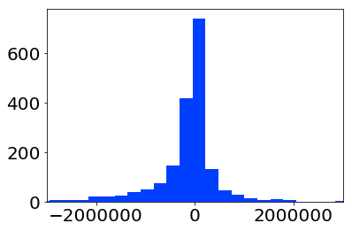

# Construction Cost estimator

## Objective

To improve the accuracy of cost estimations for construction projects. Using data from the Colorado Department of Transportation

## Background

Talk about real measures of error instead of BS in porigianl work
 Show picture of error distribution and figures of how much money above the estimates vs below averages and totals
 

## Assumptions

As the data comes with no descriptions, I had to make a few assumptions:

* The Actual costs are the predicted by the winner bid plus or minus the order changes.
* The prices of labour and material are only affected in time by the Comsumer Price Index (Average Price).
* If is not reported it doesn'exist.

    

## ETL

* Money ammounts were stored as strings, so they needed to be converted to numbers.
* Money was adjusted for inflation using the Consumer Price Index.
* Deserted bids were discarded.
* Averaged bids included in the databse for some obscure reason were discarded
* Data was aggregated per bid
* Features were created like umber of participants, min, max, mean and of proposals, as well as spread (defined as the difference between min and max proposal, and eccentricity (were the winning bid seats between min and max)

## Modeling

### Base Model

I tried a base model with Ordinary Least Squares, and a small set of features selected for two reasons:

* To reduce colinearity problems.
* To predict before knowing who won the bid.

After evaluate it with K-fold, the average residual was 26,535,315.57 and the average error (agains unseen data) was 13,908,228.96.

## ElasticNet

ElasticNet regularizes the model as a combination of L1 and L2 regularization. It is supposed to behave better in the presence of colinearity.

### Base Model

Using the same model as before, minimal colinearity the model estimated alpha and l1_ratio as 367.40 and 0.5 respectively, and the Residual and errors were 821,8874,701.86 and 118,423,068.50. These model performed terribly compared with the OLS.

### More data

Since ElasticNet strenth is supposed to its colinearity tolerance, I made a new model using everything non dependant on the actuals, it is:
* Winning Bid 2017
* Engineers Estimate 2017
* No of participants', 'Bid 2017 mean
* Bid 2017 min
* Bid 2017 max
* Spread
* Eccentricity 1
* Eccentricity 2

This is a bit abusive and probably midguided, but, hey, it's just a test!

The results are (expetedly?) dissapointing residuals and errors are 8,323,752,586.67 (8 BILLIONS!!!) and 11,242,4015.26.

## Nice observation

Besides the models showing not so great performance, the distribution of the errors on the unseen data (difference between estimation and actual cost) was narrower than the distribution of the errors between the actuals and the Engineer's estimate (don't forget that there is an incentive for understimation, since it might lead to lower bids).

### Model Error distirbution

### Engineer's Error Distribution

## Future work

Test different combinations of regularization techniques and selections of X, to improve the results.
